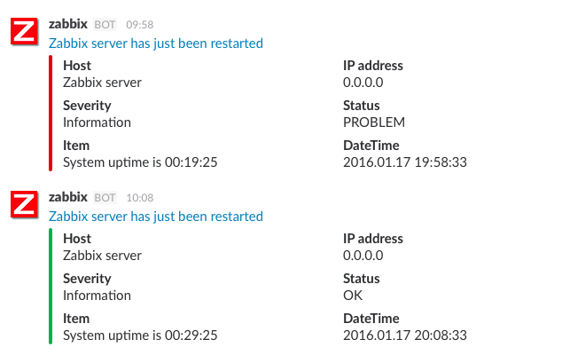
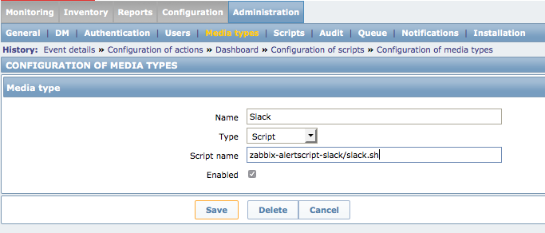
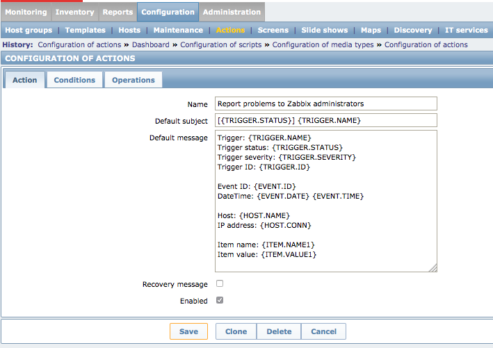

Zabbix Alert Script for Slack
================================================================================




Requirements
--------------------------------------------------------------------------------

- Zabbix 2.2 LTS, 3.0 LTS
- Slack [Incoming Webhook URL](https://api.slack.com/incoming-webhooks)


Getting Started
--------------------------------------------------------------------------------

### Installation

Clone this repository to Zabbix alert scripts directory:

```sh
$ cd /path/to/your/zabbix/alertscripts
$ git clone https://github.com/Tomohiro/zabbix-alertscript-slack
```

NOTE: Run below command if you want to upgrade to latest this script.

```sh
$ cd /path/to/your/zabbix/alertscripts/zabbix-alertscript-slack
$ git pull origin master
```


### Configuration

Set the environment variables to Zabbix server process.

CentOS 6:

```sh
$ sudo echo 'export SLACK_WEBHOOK_URL=https://hooks.slack.com/services/....' >> /etc/sysconfig/zabbix-server
$ sudo echo 'export ZABBIX_ENDPOINT=http://your-zabbix.example.com' >> /etc/sysconfig/zabbix-server
$ sudo service zabbix-server restart
```

CentOS 7:

```sh
$ sudo mkdir /etc/systemd/system/zabbix-server.service.d/
$ sudo cat <<EOF > /etc/systemd/system/zabbix-server.service.d/10-environment.conf
[Service]
Environment=ZABBIX_ENDPOINT=http://your-zabbix.example.com
Environment=SLACK_WEBHOOK_URL=https://hooks.slack.com/services/....
EOF
$ sudo systemctl restart zabbix-server
```


Register installed script to a media type:



Set macros the default message of an action:




### Example: Action default message

```
Trigger: {TRIGGER.NAME}
Trigger status: {TRIGGER.STATUS}
Trigger severity: {TRIGGER.SEVERITY}
Trigger ID: {TRIGGER.ID}

Event ID: {EVENT.ID}
DateTime: {EVENT.DATE} {EVENT.TIME}

Host: {HOST.NAME}
IP address: {HOST.CONN}

Item name: {ITEM.NAME1}
Item value: {ITEM.VALUE1}
```


Acknowledgements
--------------------------------------------------------------------------------

- [ZabbixからSlackへちょっとリッチな通知をする - Qiita](http://qiita.com/bageljp@github/items/20be937ca3bb92100e8f)
- [bageljp/zabbix-slack](https://github.com/bageljp/zabbix-slack)


LICENSE
--------------------------------------------------------------------------------

&copy; 2015 - 2016 Tomohiro TAIRA.

This project is licensed under the MIT license. See [LICENSE](LICENSE) for details.
